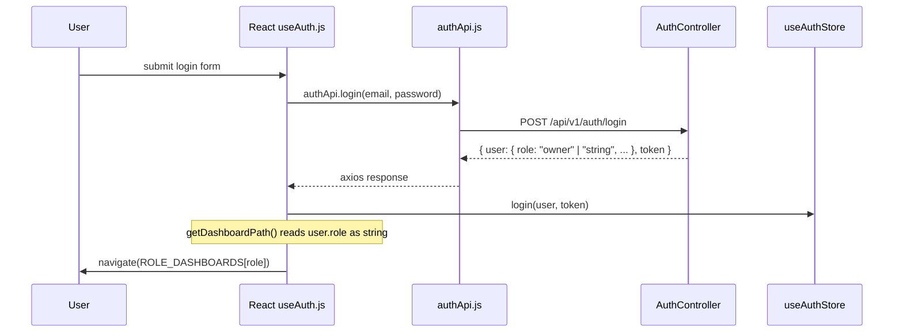
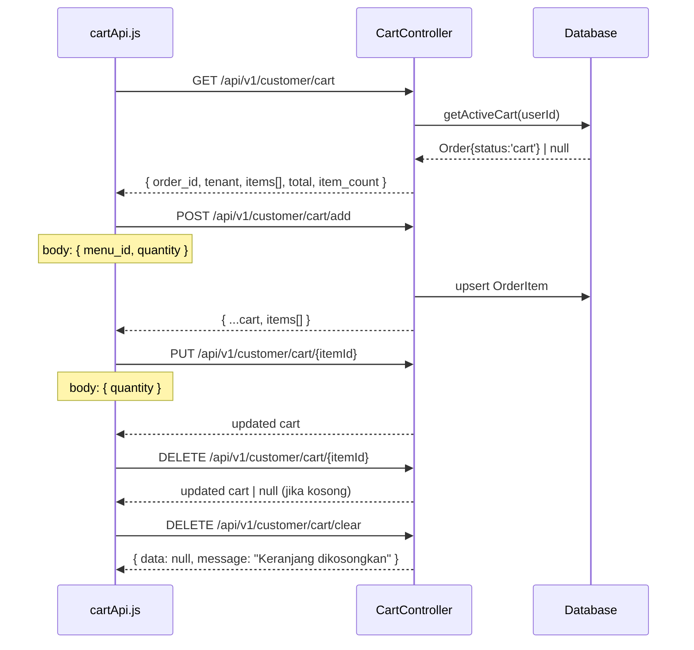
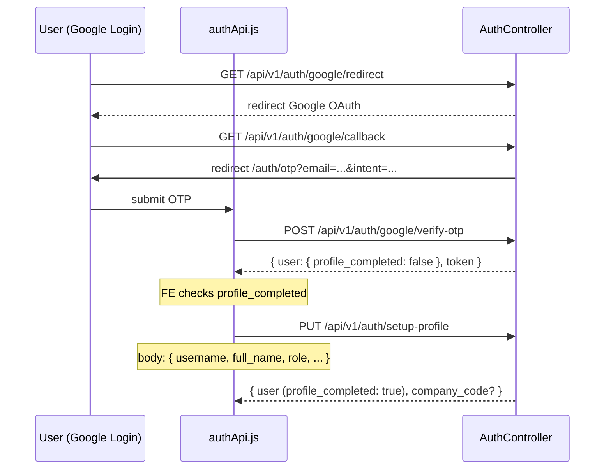
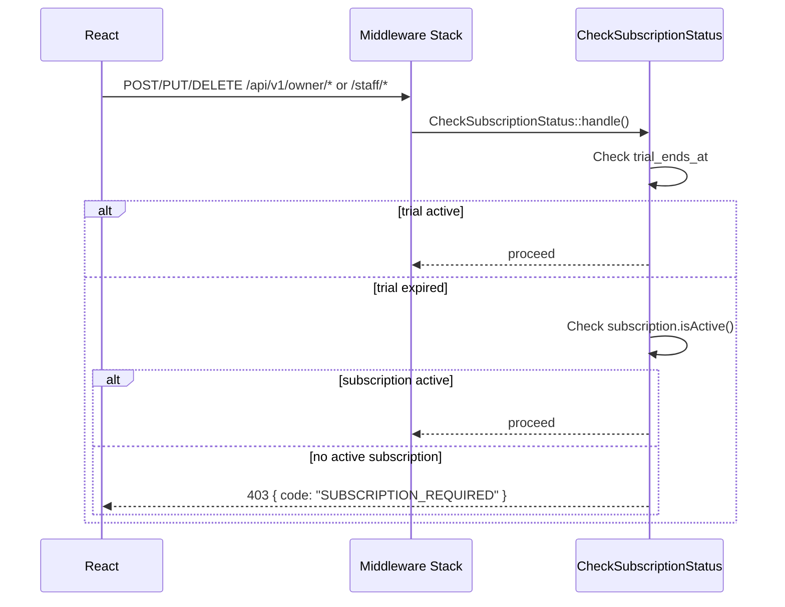

# Design Document: Frontend-Backend Integration Fix — KantinKita

## Overview

Dokumen ini merinci semua perbaikan yang dibutuhkan untuk menyambungkan frontend React (Vite) dengan backend Laravel di proyek KantinKita. Audit menidentifikasi 12 masalah yang tersebar di mismatch URL path, method yang hilang, response parsing yang salah, dan middleware yang belum terhubung. Dokumen ini mendefinisikan kontrak eksplisit antara kedua sisi, perubahan per file, dan properti correctness untuk verifikasi.

### Temuan Kritis dari Audit `bootstrap/app.php`

> **PENTING**: `apiPrefix: 'api/v1'` sudah terkonfigurasi di `bootstrap/app.php` (`withRouting(..., apiPrefix: 'api/v1')`). Artinya semua route di `routes/api.php` sudah otomatis menjadi `/api/v1/...`. Isu #1 (prefix mismatch) BUKAN masalah backend — backend sudah benar. Frontend yang menggunakan `/api/v1/...` juga sudah benar.
>
> Begitu pula `LogActivity` middleware sudah di-prepend ke semua API middleware group (isu #11 sudah teratasi secara global).
>
> Implikasi: fokus perbaikan adalah **cart URL path**, **metode yang hilang**, dan **response parsing**.

---

## Architecture

```mermaid
graph TD
    subgraph "React Frontend (Vite)"
        UI[Pages & Components]
        HK[Custom Hooks]
        API_LAYER[API Layer\nsrc/api/*.js]
        STORE[Zustand Store\nauthStore.js]
        AX[Axios Instance\naxios.js]
    end

    subgraph "Laravel Backend"
        SANCTUM[Sanctum Auth\nBearer Token]
        MW[Middleware Stack\nrole, permission,\ntenant.active, subscription.check]
        ROUTES[routes/api.php\nprefix: api/v1]
        CTRL[Controllers]
        SVC[Services]
        DB[(MySQL Database)]
    end

    UI --> HK
    HK --> API_LAYER
    API_LAYER --> AX
    AX -->|Authorization: Bearer {token}| SANCTUM
    STORE -->|token| AX
    SANCTUM --> MW
    MW --> ROUTES
    ROUTES --> CTRL
    CTRL --> SVC
    SVC --> DB
```

---

## Sequence Diagrams

### Auth Flow (Login + Role-based Redirect)



### Cart Flow (setelah fix)



### Setup Profile Flow (Google OAuth)



### Subscription Check Flow



---

## Components and Interfaces

### 1. `src/api/cart.js` — Perbaikan URL Path

**Masalah**: Semua endpoint cart hilang prefix `/customer` dan POST add menggunakan path salah.

**Interface setelah fix**:

```javascript
// src/api/cart.js (AFTER FIX)
export const cartApi = {
  getCart:    () => api.get('/api/v1/customer/cart'),
  addItem:    (menuId, quantity) => api.post('/api/v1/customer/cart/add', { menu_id: menuId, quantity }),
  updateItem: (cartItemId, quantity) => api.put(`/api/v1/customer/cart/${cartItemId}`, { quantity }),
  removeItem: (cartItemId) => api.delete(`/api/v1/customer/cart/${cartItemId}`),
  clearCart:  () => api.delete('/api/v1/customer/cart/clear'),
}
```

**Mapping perubahan**:

| Method | Before (❌) | After (✅) |
|--------|------------|-----------|
| GET    | `/api/v1/cart` | `/api/v1/customer/cart` |
| POST   | `/api/v1/cart` | `/api/v1/customer/cart/add` |
| PUT    | `/api/v1/cart/{id}` | `/api/v1/customer/cart/{id}` |
| DELETE | `/api/v1/cart/{id}` | `/api/v1/customer/cart/{id}` |
| DELETE | `/api/v1/cart` | `/api/v1/customer/cart/clear` |

---

### 2. `src/api/auth.js` — Tambah `setupProfile`

**Masalah**: `PUT /api/v1/auth/setup-profile` ada di backend tapi tidak ada di frontend.

```javascript
// src/api/auth.js — tambahkan method ini
setupProfile: (data) =>
  api.put('/api/v1/auth/setup-profile', data),
```

**Request Body** untuk `setupProfile`:

```javascript
{
  username:    String,   // required, unique
  full_name:   String,   // required
  email:       String,   // required, unique
  no_ktp:      String,   // optional
  phone:       String,   // optional
  dob:         String,   // optional (date)
  role:        "customer" | "owner",  // required
  tenant_name: String,   // required jika role === "owner"
  password:    String,   // required, min 8
  password_confirmation: String  // required
}
```

**Response Shape**:

```javascript
{
  status: true,
  message: "Setup profil berhasil disimpan",
  data: {
    id: Number,
    username: String,
    full_name: String,
    email: String,
    role: String,
    profile_completed: true,
    // jika role === "owner":
    company_code: String,
    tenant: { id, tenant_name, company_code, trial_ends_at, ... }
  }
}
```

---

### 3. `src/hooks/useAuth.js` — Fix `hasRole()` untuk role object

**Masalah**: `user.role` dari backend bisa berupa string (`"owner"`) atau object (`{ slug: "owner", name: "Owner" }`). `hasRole` saat ini hanya menangani string.

```javascript
// src/hooks/useAuth.js — BEFORE (❌)
const hasRole = useCallback(
  (...roles) => roles.includes(user?.role),
  [user?.role]
);

// AFTER (✅)
const hasRole = useCallback(
  (...roles) => {
    const roleValue = user?.role?.slug ?? user?.role;
    return roles.includes(roleValue);
  },
  [user?.role]
);

// getDashboardPath juga harus difix
const getDashboardPath = useCallback(() => {
  const roleValue = user?.role?.slug ?? user?.role;
  return ROLE_DASHBOARDS[roleValue] ?? '/';
}, [user?.role]);
```

**Catatan**: `useAuthStore` sudah memiliki `getRole()` dan `isRole()` yang handle case ini dengan benar. `useAuth.js` harus konsisten.

---

### 4. `src/hooks/useOrders.js` — Fix `useCustomerOrders` response parsing

**Masalah**: `useCustomerOrders` mengembalikan full axios response, bukan data yang dipaginasi.

```javascript
// BEFORE (❌) — returns full axios response object
queryFn: () => orderApi.getOrders(filters).then((r) => r.data),

// AFTER (✅) — returns paginated data dari backend
queryFn: () => orderApi.getOrders(filters).then((r) => r.data.data),
```

**Response shape dari backend** (CustomerOrderController):

```javascript
// r.data (parsed axios)
{
  status: true,
  message: "Berhasil",
  data: {                      // ← ini yang dibutuhkan
    current_page: 1,
    data: [ ...orders ],
    per_page: 15,
    total: 42,
    last_page: 3,
    // ...pagination meta
  }
}
```

---

### 5. `src/api/admin.js` — Tambah missing endpoints

**Masalah**: Tiga endpoint backend tidak punya padanannya di `adminApi`.

```javascript
// src/api/admin.js — tambahkan:

// Audit Logs Export
exportAuditLogs: (params = {}) =>
  api.get('/api/v1/admin/audit-logs/export', {
    params,
    responseType: 'blob',  // response CSV
  }),

// Admin Report Aggregate (platform-wide)
getAdminReportAggregate: (params = {}) =>
  api.get('/api/v1/admin/reports/aggregate', { params }),
```

**Export params** (opsional): `{ start_date: "YYYY-MM-DD", end_date: "YYYY-MM-DD" }`

**Aggregate response shape**:

```javascript
{
  status: true,
  data: {
    summary: { total_revenue, total_orders, avg_order_value },
    top_menus: [{ name, count }],
    daily_revenue: [{ date, total }]
  }
}
```

---

### 6. `src/api/report.js` — Fix `getAdminReport` path

**Masalah**: `GET /api/v1/admin/reports` tidak ada di backend. Yang ada adalah `/admin/reports/aggregate`.

```javascript
// BEFORE (❌)
getAdminReport: (params = {}) =>
  api.get('/api/v1/admin/reports', { params }),

// AFTER (✅)
getAdminReport: (params = {}) =>
  api.get('/api/v1/admin/reports/aggregate', { params }),
```

---

### 7. `src/api/report.js` — Tambah Owner Subscription Invoices

**Masalah**: `GET /api/v1/owner/subscription/invoices` ada di backend tapi tidak ada di frontend.

```javascript
// src/api/report.js — tambahkan:
getSubscriptionInvoices: () =>
  api.get('/api/v1/owner/subscription/invoices'),
```

**Response shape**:

```javascript
{
  status: true,
  data: [
    {
      id: Number,
      invoice_number: String,
      plan: "starter" | "professional" | "enterprise",
      amount: Number,
      billing_status: "pending" | "active" | "cancelled",
      approval_status: "pending" | "approved" | "rejected",
      billing_start: String | null,
      billing_end: String | null,
      created_at: String
    }
  ]
}
```

---

### 8. `routes/api.php` — Tambah `subscription.check` Middleware

**Masalah**: `CheckSubscriptionStatus` middleware sudah ada dan teregistrasi sebagai alias `subscription.check`, tapi belum diapply ke route owner/staff write operations.

**Perbaikan**:

```php
// routes/api.php — OWNER write routes, wrap dengan subscription.check
Route::middleware(['role:owner', 'tenant.active', 'subscription.check'])->prefix('owner')->group(function () {
    // semua route owner tetap sama
});

// STAFF write routes
Route::middleware(['role:staff', 'tenant.active', 'subscription.check'])->prefix('staff')->group(function () {
    // semua route staff tetap sama
});
```

**Catatan**: Middleware `CheckSubscriptionStatus` sudah bypass GET/HEAD/OPTIONS secara internal, jadi tidak perlu pisahkan read/write route.

---

### 9. `src/store/authStore.js` — Fix stopImpersonating (Token Revoke)

**Masalah**: Saat stop impersonating, token target user tidak di-revoke di backend.

**Perbaikan di `stopImpersonating`**:

```javascript
// authStore.js — stopImpersonating perlu call backend
// Namun karena ini di Zustand store, handle di komponen/hook level
// Buat useImpersonation hook terpisah:
```

```javascript
// src/hooks/useImpersonation.js (baru)
import { useAuthStore } from '../store/authStore';
import { adminApi } from '../api/admin';

export function useImpersonation() {
  const { isImpersonating, stopImpersonating } = useAuthStore();

  const handleStopImpersonating = async () => {
    try {
      // Revoke current (impersonated) token di backend
      await import('../api/auth').then(m => m.authApi.logout());
    } catch (_) {
      // silently ignore — token mungkin sudah invalid
    } finally {
      stopImpersonating();
    }
  };

  return { isImpersonating, stopImpersonating: handleStopImpersonating };
}
```

---

### 10. `tenantApi.updateMenu()` — Method Spoofing dengan FormData

**Masalah**: Saat `updateMenu` dipanggil dengan FormData, frontend menggunakan `POST` biasa tanpa menyertakan `_method=PUT`. Backend hanya memiliki `PUT /api/v1/staff/menus/{id}`.

**Verifikasi**: Laravel secara default menangani `_method` field via `HandleMethodOverride` yang sudah include di HTTP Kernel. Untuk Sanctum API, ini juga berlaku.

**Perbaikan di `tenantApi.updateMenu`**:

```javascript
// src/api/tenant.js
updateMenu: (id, data) => {
  if (data instanceof FormData) {
    data.append('_method', 'PUT');  // ← tambahkan ini
    return api.post(`/api/v1/staff/menus/${id}`, data);
  }
  return api.put(`/api/v1/staff/menus/${id}`, data);
},
```

**Catatan Backend**: Pastikan `App\Http\Middleware\TrustProxies` atau `\Illuminate\Foundation\Http\Middleware\ConvertEmptyStringsToNull` tidak membuang `_method`. Dengan Laravel 11 default config ini sudah handled.

---

## Data Models

### User Object (dari backend `/auth/me` dan `/auth/login`)

```javascript
{
  id: Number,
  username: String,
  full_name: String,
  email: String,
  phone: String | null,
  photo: String | null,          // URL atau path relatif storage
  role: String,                   // "admin" | "owner" | "staff" | "customer"
  company_code: String,
  profile_completed: Boolean,
  status: 0 | 1,
  tenant: TenantObject | null,   // untuk owner/staff
  assignedRole: RoleObject | null,
  computed_permissions: String[], // ["read-menu", "create-menu", ...]
  created_at: String,
  updated_at: String
}
```

### Cart Response Object

```javascript
// GET /api/v1/customer/cart
{
  status: true,
  data: {
    order_id: Number,
    tenant: { id, tenant_name, slug, ... },
    items: [
      {
        id: Number,           // OrderItem ID — digunakan untuk update/remove
        menu_id: Number,
        menu_name: String,
        price: Number,
        quantity: Number,
        subtotal: Number,
        menu: { id, name, photo, category: { id, name }, ... }
      }
    ],
    total: Number,
    item_count: Number
  }
}
```

### Order/Checkout Response

```javascript
// POST /api/v1/customer/checkout
{
  status: true,
  data: {
    id: Number,
    order_number: String,   // "ORD-xxxx"
    status: "pending" | "paid" | "processing" | "completed" | "cancelled",
    total_amount: Number,
    grand_total: Number,
    notes: String | null,
    tenant: TenantObject,
    items: OrderItem[],
    payment_url: String | null  // Midtrans snap token/URL jika ada
  }
}
```

### Paginated Response Wrapper

```javascript
// Semua endpoint paginated mengikuti format ini
{
  status: true,
  message: String,
  data: {
    current_page: Number,
    data: Array,
    first_page_url: String,
    from: Number,
    last_page: Number,
    last_page_url: String,
    links: Array,
    next_page_url: String | null,
    path: String,
    per_page: Number,
    prev_page_url: String | null,
    to: Number,
    total: Number
  }
}
```

### Subscription Invoice Object

```javascript
{
  id: Number,
  invoice_number: String,
  plan: "starter" | "professional" | "enterprise",
  amount: Number,
  billing_status: "pending" | "active" | "cancelled",
  approval_status: "pending" | "approved" | "rejected",
  billing_start: String | null,   // "YYYY-MM-DD"
  billing_end: String | null,
  admin_notes: String | null,
  company_code: String,
  created_at: String,
  updated_at: String
}
```

---

## Error Handling Strategy

### HTTP Status Code Mapping (Frontend → User Message)

```javascript
// src/api/axios.js — response interceptor (sudah ada, dokumentasi saja)
switch (status) {
  case 401: // Unauthenticated → logout + redirect /login
  case 403: // Forbidden (role mismatch atau SUBSCRIPTION_REQUIRED)
            // FE harus check error.response.data.code === 'SUBSCRIPTION_REQUIRED'
            // untuk redirect ke halaman subscription
  case 404: // Not found — biasanya data tidak ada
  case 422: // Validation error — tampilkan per-field errors
  case 429: // Rate limited — informasi ke user
  case 500: // Server error — generic toast
}
```

### Special Case: `SUBSCRIPTION_REQUIRED` (403)

```javascript
// Di axios.js interceptor, tambahkan handling khusus:
case 403:
  if (error.response?.data?.code === 'SUBSCRIPTION_REQUIRED') {
    toast.error('Masa trial habis. Silakan pilih paket berlangganan.');
    // Optional: navigate to subscription page
    const role = useAuthStore.getState().getRole();
    if (role === 'owner') {
      window.location.href = '/owner/subscription';
    }
  } else {
    toast.error('Akses ditolak: ' + (error.response?.data?.message ?? ''));
  }
  break;
```

### Validation Error Handling (422)

Backend mengembalikan:
```javascript
{
  status: false,
  message: "Validasi gagal.",
  errors: {
    "field_name": ["Error message 1", "Error message 2"],
    "email": ["The email has already been taken."]
  }
}
```

Frontend harus extract `error.response?.data?.errors` untuk tampil per-field.

---

## Complete Route Inventory (Ground Truth)

Tabel lengkap semua route backend setelah `apiPrefix: 'api/v1'`:

### Auth Routes

| Method | Path | Controller | Auth Required |
|--------|------|-----------|---------------|
| POST | `/api/v1/auth/register` | AuthController@register | No |
| POST | `/api/v1/auth/login` | AuthController@login | No |
| POST | `/api/v1/auth/check-company` | AuthController@checkCompany | No |
| GET | `/api/v1/auth/google/redirect` | AuthController@redirectToGoogle | No |
| GET | `/api/v1/auth/google/callback` | AuthController@handleGoogleCallback | No |
| POST | `/api/v1/auth/google/verify-otp` | AuthController@verifyGoogleOtp | No |
| POST | `/api/v1/auth/forgot-password` | AuthController@forgotPassword | No |
| POST | `/api/v1/auth/reset-password` | AuthController@resetPassword | No |
| POST | `/api/v1/auth/logout` | AuthController@logout | ✅ |
| GET | `/api/v1/auth/me` | AuthController@me | ✅ |
| POST | `/api/v1/auth/profile` | AuthController@updateProfile | ✅ |
| PUT | `/api/v1/auth/setup-profile` | AuthController@setupProfile | ✅ |
| PUT | `/api/v1/auth/change-password` | AuthController@changePassword | ✅ |

### Customer Routes (role: customer)

| Method | Path | Notes |
|--------|------|-------|
| GET | `/api/v1/customer/cart` | |
| POST | `/api/v1/customer/cart/add` | body: { menu_id, quantity } |
| PUT | `/api/v1/customer/cart/{id}` | id = OrderItem.id |
| DELETE | `/api/v1/customer/cart/{id}` | id = OrderItem.id |
| DELETE | `/api/v1/customer/cart/clear` | |
| POST | `/api/v1/customer/checkout` | body: { notes? } |
| GET | `/api/v1/customer/orders` | paginated |
| GET | `/api/v1/customer/orders/{id}` | |

### Staff Routes (role: staff, tenant.active)

| Method | Path |
|--------|------|
| GET | `/api/v1/staff/orders` |
| PUT | `/api/v1/staff/orders/{id}/status` |
| GET/POST | `/api/v1/staff/menus` |
| PUT/DELETE | `/api/v1/staff/menus/{id}` |
| PUT | `/api/v1/staff/menus/{id}/availability` |
| GET/POST | `/api/v1/staff/categories` |
| PUT/DELETE | `/api/v1/staff/categories/{id}` |
| GET | `/api/v1/staff/staff` |
| GET | `/api/v1/staff/reports` |

### Owner Routes (role: owner, tenant.active)

| Method | Path |
|--------|------|
| GET | `/api/v1/owner/reports` |
| GET | `/api/v1/owner/reports/aggregate` |
| GET | `/api/v1/owner/reports/export/pdf` |
| GET | `/api/v1/owner/reports/export/csv` |
| GET | `/api/v1/owner/orders` |
| POST | `/api/v1/owner/refund` |
| GET | `/api/v1/owner/refund/history` |
| GET/POST | `/api/v1/owner/staff` |
| PUT/DELETE | `/api/v1/owner/staff/{id}` |
| PUT | `/api/v1/owner/staff/{id}/toggle` |
| GET | `/api/v1/owner/subscription` |
| GET | `/api/v1/owner/subscription/plans` |
| GET | `/api/v1/owner/subscription/invoices` |
| POST | `/api/v1/owner/subscription/subscribe` |

### Admin Routes (role: admin)

| Method | Path |
|--------|------|
| GET | `/api/v1/admin/tenants` |
| POST | `/api/v1/admin/tenants` |
| PUT | `/api/v1/admin/tenants/{id}` |
| DELETE | `/api/v1/admin/tenants/{id}` |
| PATCH | `/api/v1/admin/tenants/{id}/toggle` |
| GET | `/api/v1/admin/users` |
| POST | `/api/v1/admin/users` |
| PUT | `/api/v1/admin/users/{id}` |
| DELETE | `/api/v1/admin/users/{id}` |
| PATCH | `/api/v1/admin/users/{id}/toggle` |
| POST | `/api/v1/admin/users/{id}/impersonate` |
| GET/PUT | `/api/v1/admin/settings` |
| GET | `/api/v1/admin/settings/versions` |
| GET | `/api/v1/admin/audit-logs` |
| GET | `/api/v1/admin/audit-logs/export` ← **missing di adminApi** |
| GET | `/api/v1/admin/error-logs` |
| GET | `/api/v1/admin/error-logs/stats` |
| PATCH | `/api/v1/admin/error-logs/{id}/resolve` |
| GET/POST | `/api/v1/admin/backups` |
| POST | `/api/v1/admin/backups/restore` |
| DELETE | `/api/v1/admin/backups/{filename}` |
| GET | `/api/v1/admin/backups/{filename}/download` |
| CRUD | `/api/v1/admin/permissions` |
| CRUD | `/api/v1/admin/roles` |
| POST | `/api/v1/admin/roles/{id}/sync` |
| CRUD | `/api/v1/admin/document-types` |
| GET | `/api/v1/admin/subscriptions` |
| GET | `/api/v1/admin/subscriptions/stats` |
| PUT | `/api/v1/admin/subscriptions/{id}/approve` |
| PUT | `/api/v1/admin/subscriptions/{id}/reject` |
| GET | `/api/v1/admin/reports/aggregate` ← **missing di adminApi** |
| GET | `/api/v1/admin/stats` |

---

## Summary of All Changes

### Backend Changes

| File | Perubahan | Severity |
|------|-----------|----------|
| `routes/api.php` | Tambah `subscription.check` middleware ke owner + staff group | 🟠 HIGH |

### Frontend Changes

| File | Perubahan | Severity |
|------|-----------|----------|
| `src/api/cart.js` | Fix semua 5 URL paths (tambah `/customer` prefix + fix POST path) | 🔴 CRITICAL |
| `src/api/auth.js` | Tambah `setupProfile()` method | 🔴 CRITICAL |
| `src/hooks/useAuth.js` | Fix `hasRole()` dan `getDashboardPath()` untuk handle role object | 🟠 HIGH |
| `src/hooks/useOrders.js` | Fix `useCustomerOrders` response parsing `.data` → `.data.data` | 🟠 HIGH |
| `src/api/admin.js` | Tambah `exportAuditLogs()` dan `getAdminReportAggregate()` | 🟡 MEDIUM |
| `src/api/report.js` | Fix `getAdminReport` path: `/admin/reports` → `/admin/reports/aggregate` | 🟠 HIGH |
| `src/api/report.js` | Tambah `getSubscriptionInvoices()` | 🟠 HIGH |
| `src/api/tenant.js` | Tambah `_method: 'PUT'` ke FormData di `updateMenu()` | 🟡 MEDIUM |
| `src/hooks/useImpersonation.js` | File baru — handle token revoke saat stop impersonating | 🟡 MEDIUM |

---

## Testing Strategy

### Unit Testing Approach

Test setiap fungsi API layer secara terisolasi dengan mock axios.

**Tool**: Vitest + `vi.mock()` untuk axios

```javascript
// cart.test.js
describe('cartApi', () => {
  it('getCart calls correct endpoint', async () => {
    vi.mocked(api.get).mockResolvedValue({ data: mockCartResponse });
    await cartApi.getCart();
    expect(api.get).toHaveBeenCalledWith('/api/v1/customer/cart');
  });

  it('addItem calls /customer/cart/add with correct body', async () => {
    await cartApi.addItem(5, 2);
    expect(api.post).toHaveBeenCalledWith(
      '/api/v1/customer/cart/add',
      { menu_id: 5, quantity: 2 }
    );
  });

  it('clearCart calls DELETE /customer/cart/clear', async () => {
    await cartApi.clearCart();
    expect(api.delete).toHaveBeenCalledWith('/api/v1/customer/cart/clear');
  });
});
```

### Property-Based Testing Approach

**Tool**: fast-check (JavaScript)

```javascript
import fc from 'fast-check';

// Property: semua cartApi methods selalu mengirim ke path yang mengandung "/customer/"
fc.property(
  fc.integer({ min: 1, max: 9999 }),
  fc.integer({ min: 1, max: 99 }),
  (itemId, quantity) => {
    const putCall = getLastCallArgs(api.put);
    expect(putCall[0]).toContain('/customer/');
  }
);

// Property: hasRole selalu mengembalikan boolean
fc.property(
  fc.oneof(
    fc.string(),
    fc.record({ slug: fc.string(), name: fc.string() })
  ),
  fc.array(fc.string()),
  (role, roles) => {
    const result = hasRoleFn(role)(roles);
    expect(typeof result).toBe('boolean');
  }
);

// Property: useCustomerOrders response selalu berupa paginated structure
fc.property(
  fc.array(fc.record({ id: fc.integer(), status: fc.string() })),
  (orders) => {
    const response = buildPaginatedResponse(orders);
    expect(response).toHaveProperty('data');
    expect(response).toHaveProperty('current_page');
    expect(response).toHaveProperty('total');
    expect(Array.isArray(response.data)).toBe(true);
  }
);
```

### Integration Testing Approach

Test end-to-end dengan Laravel API menggunakan Laravel's built-in test client.

```php
// CartTest.php
public function test_customer_can_get_cart()
{
    $customer = User::factory()->create(['role' => 'customer']);
    $response = $this->actingAs($customer)
        ->getJson('/api/v1/customer/cart');
    
    $response->assertStatus(200)
        ->assertJsonStructure([
            'status', 'data' => ['items', 'total', 'item_count']
        ]);
}

public function test_add_item_creates_cart_with_correct_tenant()
{
    $customer = User::factory()->create(['role' => 'customer']);
    $menu = Menu::factory()->create();
    
    $this->actingAs($customer)
        ->postJson('/api/v1/customer/cart/add', [
            'menu_id' => $menu->id,
            'quantity' => 2
        ])
        ->assertStatus(200)
        ->assertJsonPath('data.tenant.id', $menu->tenant_id);
}
```

---

## Error Handling

Lihat bagian **Error Handling Strategy** di atas untuk detail lengkap mapping HTTP status codes dan penanganan `SUBSCRIPTION_REQUIRED`.

---

## Correctness Properties

*A property is a characteristic or behavior that should hold true across all valid executions of a system — essentially, a formal statement about what the system should do. Properties serve as the bridge between human-readable specifications and machine-verifiable correctness guarantees.*

### Property 1: Cart URL Correctness

*For any* method pada `cartApi` yang dipanggil (getCart, addItem, updateItem, removeItem, clearCart), URL yang dikirim ke backend selalu mengandung prefix `/api/v1/customer/` sebagai bagian dari path-nya.

**Validates: Requirements 1.1, 1.2, 1.3, 1.4, 1.5, 1.6**

### Property 2: Cart Add Path

*For any* kombinasi `menuId` (integer positif) dan `quantity` (integer positif), `cartApi.addItem(menuId, quantity)` selalu mengirim POST ke `/api/v1/customer/cart/add` dengan body `{ menu_id: menuId, quantity }` — tidak pernah ke `/api/v1/customer/cart`.

**Validates: Requirements 1.2**

### Property 3: Cart Clear Path

*For any* panggilan ke `cartApi.clearCart()`, request yang dikirim selalu DELETE ke `/api/v1/customer/cart/clear` — tidak pernah ke `/api/v1/customer/cart`.

**Validates: Requirements 1.3**

### Property 4: setupProfile Request Contract

*For any* data object yang diberikan ke `authApi.setupProfile(data)`, fungsi ini selalu mengirim PUT request ke `/api/v1/auth/setup-profile` dengan data tersebut sebagai request body tanpa modifikasi.

**Validates: Requirements 2.1, 2.2, 2.3, 2.5**

### Property 5: hasRole Polymorphic Safety

*For any* nilai `user.role` — baik berupa string `"owner"` maupun object `{ slug: "owner", name: "Owner" }` — `useAuth().hasRole('owner')` mengembalikan `true`. *For any* nilai `user.role` yang bukan `"owner"` dalam format apapun, hasilnya adalah `false`.

**Validates: Requirements 3.1, 3.2, 3.3, 3.4**

### Property 6: Customer Orders Data Shape

*For any* paginated response yang dikembalikan backend untuk `GET /api/v1/customer/orders`, `useCustomerOrders()` mengembalikan objek yang memiliki properti `data` (Array), `current_page` (Number), `total` (Number), `last_page` (Number), dan `per_page` (Number) — bukan raw axios response object.

**Validates: Requirements 4.1, 4.2, 4.3, 4.4**

### Property 7: Admin Report Path Correctness

*For any* panggilan ke `reportApi.getAdminReport(params)`, request yang dikirim selalu menuju `/api/v1/admin/reports/aggregate` — tidak pernah ke `/api/v1/admin/reports` (path yang tidak ada di backend).

**Validates: Requirements 5.1**

### Property 8: Subscription Invoices API Contract

*For any* panggilan ke `reportApi.getSubscriptionInvoices()`, request yang dikirim adalah GET ke `/api/v1/owner/subscription/invoices`.

**Validates: Requirements 5.2, 5.3**

### Property 9: Admin Audit Export API Contract

*For any* panggilan ke `adminApi.exportAuditLogs(params)`, request yang dikirim adalah GET ke `/api/v1/admin/audit-logs/export` dengan konfigurasi `responseType: 'blob'`.

**Validates: Requirements 5.4, 5.5**

### Property 10: Admin Report Aggregate API Contract

*For any* panggilan ke `adminApi.getAdminReportAggregate(params)`, request yang dikirim adalah GET ke `/api/v1/admin/reports/aggregate`.

**Validates: Requirements 5.6, 5.7**

### Property 11: Method Spoofing FormData

*For any* `id` (integer positif) dan `FormData` object yang diberikan ke `tenantApi.updateMenu(id, formData)`, request yang dikirim adalah POST ke `/api/v1/staff/menus/{id}` dengan field `_method` bernilai `'PUT'` di dalam FormData.

**Validates: Requirements 7.1, 7.2**

### Property 12: Subscription Middleware Applied

*For any* request dengan HTTP method POST, PUT, DELETE, atau PATCH yang dikirim ke `/api/v1/owner/*` atau `/api/v1/staff/*` oleh tenant dengan `trial_ends_at` yang sudah lewat dan tidak memiliki subscription aktif, response backend adalah HTTP 403 dengan body `{ code: "SUBSCRIPTION_REQUIRED" }`.

**Validates: Requirements 6.1, 6.2**

### Property 13: LogActivity Global

*For any* mutating request (POST, PUT, DELETE, PATCH) yang berhasil ke `/api/v1/*`, sebuah entri baru akan tersimpan di tabel `activity_logs` — sudah terpenuhi via konfigurasi `LogActivity` middleware di `bootstrap/app.php`.

**Validates: Requirements 6.1** *(pre-condition: logging sudah aktif, tidak memerlukan perubahan)*

### Property 14: Role Normalization Consistency

*For any* user object dengan nilai `role` dalam format apapun (string atau Role_Object), `useAuthStore.getRole()`, `useAuthStore.isRole(role)`, dan `useAuth().hasRole(role)` semua menghasilkan hasil yang identik ketika dipanggil untuk user yang sama.

**Validates: Requirements 3.5, 3.6**

---

## Security Considerations

1. **Token Exposure**: `impersonateUser` menghasilkan Sanctum token baru untuk target user. Token ini harus di-revoke saat `stopImpersonating` dipanggil. Jika tidak, token orphan tetap valid hingga expired.

2. **SUBSCRIPTION_REQUIRED bypass**: Middleware `CheckSubscriptionStatus` hanya mem-block write operations. GET requests tetap bisa diakses oleh tenant dengan expired trial — ini by design (read-only access).

3. **FormData `_method`**: Method spoofing melalui `_method` field di FormData hanya aman jika `AllowedMethods` di backend tidak di-restrict. Laravel default mengizinkan ini. Tidak ada risiko keamanan tambahan karena route masih diproteksi oleh `auth:sanctum` + `role:staff`.

4. **Token di localStorage** (via Zustand persist): Gunakan `httpOnly` cookie jika membutuhkan keamanan lebih tinggi terhadap XSS, tapi untuk scope proyek ini Bearer token di localStorage sudah cukup.

---

## Dependencies

| Layer | Dependency | Versi |
|-------|-----------|-------|
| Frontend | axios | ^1.x |
| Frontend | @tanstack/react-query | ^5.x |
| Frontend | zustand | ^4.x |
| Frontend | fast-check (dev) | ^3.x |
| Backend | laravel/sanctum | ^4.x |
| Backend | league/csv | ^9.x (untuk AuditLog export) |

---

## Notes tentang Isu yang BUKAN Masalah

- **Isu #1 (Global /v1 prefix)**: ✅ SUDAH SELESAI — `bootstrap/app.php` sudah set `apiPrefix: 'api/v1'`. Tidak perlu ubah `routes/api.php`.
- **Isu #11 (LogActivity)**: ✅ SUDAH SELESAI — `LogActivity` sudah di-prepend ke API middleware group di `bootstrap/app.php`.
- **Isu #10 (Method Spoofing)**: Partial — frontend perlu tambah `_method: PUT` ke FormData, tapi backend tidak perlu diubah (Laravel sudah handle).
